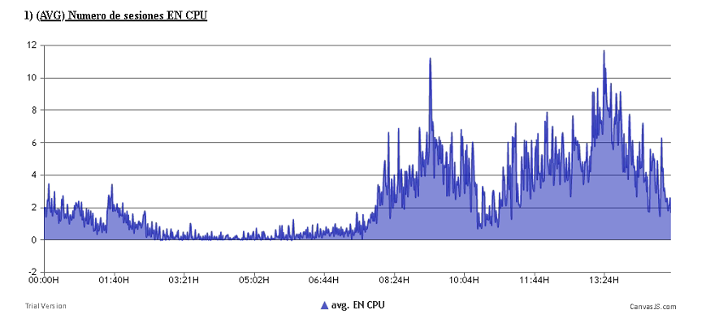
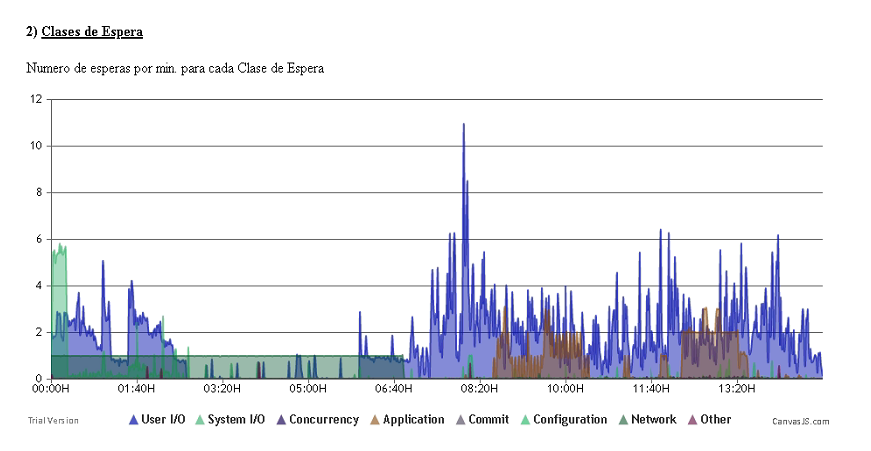
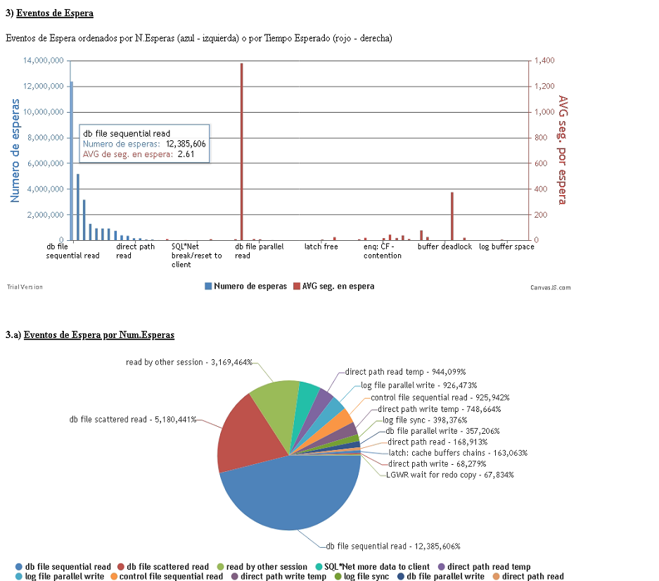

# awr_graph
<ins>Useful info of ORACLE (awr) visualized with canvas.js</ins>

Here are... 
  some bash script to connect to a Oracle DB (with AWR licensed)... 
  and daily get a visual REPORT of DB perfomance.

The database info (is a simple HTML page) shows like this:

## Sess on CPU

Number of session running on CPU.  
If you have (for example) N cpu on the server 
you had to get this graph (the maximun value) below N

## Wait Events

Waits Events on DB 

If you click on a class event, their values "disappears"  and maybe you can visualize the graph better to the other values

## Number of waits, and duration of this waits

# 1) Previous

**AWR** and **PERFSTAT** (statspack.snap) are running on database (take care with Licensing...)

You must execute on BBDD

> grant select on  SYS.V_$active_session_history to perfstat;

> grant select on  SYS.V_$osstat to perfstat;

With SYS, for example.

# 2) Create Tables and Procedures 

With user **PERFSTAT** you create some tables on BD executing **create_TABLE.sql** file

And then, execute **create_Proc.sql** file to create two proc. on database

# 3) Run the procedures 

Every hour you execute:
> execute PERFSTAT.proc_report_porhora;

every day at > 15:00 (it's harcoded on the proc, get the info from 8h to 15h)
> execute PERFSTAT.proc_report_diario(sysdate);

# 4) On unix server that runs httpd and can connect to DB 

In a directory below a httpd server:  

1) you put **canvasjs.min.js** file.   You can download from web. 

2) Download and put the <b>graficORA.zip</b> on this directory  

3) create sub-dir 
On LOG/<DB_NAME>  
On SPOOL/OUT/<DB_NAME>   

4) run
> report.sh

The results is a file:
	$BBDD.$HOY.html 

And that's all !!

